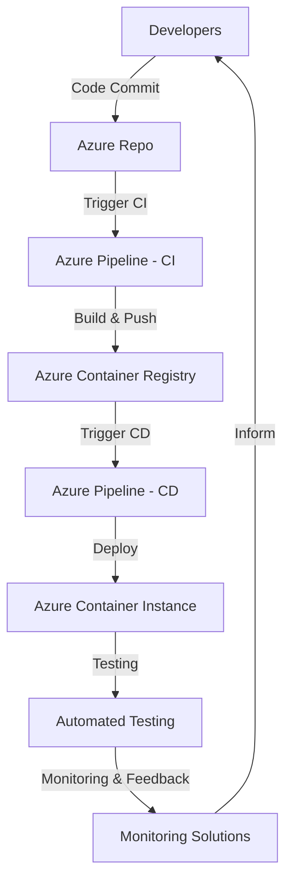

# Automated Azure Container Instance Deployment with Azure DevOps CI/CD Pipelines


## Project Description

This project aims to automate the deployment of Azure Container Instances (ACI) using Azure DevOps CI/CD pipelines for streamlined delivery of containerized applications. The solution is designed for a leading finance company facing challenges in managing the development and testing of containerized applications in non-production environments. 

By leveraging ACI and Azure DevOps, we establish a controlled testing environment that ensures the reliability and functionality of applications without disrupting production systems.

## Business Problem Statement

The finance company requires an effective way to manage the development and testing of containerized applications in non-production environments. The goal is to create a solution that leverages ACI and Azure DevOps CI/CD pipelines to ensure a controlled testing environment that guarantees application reliability and functionality.

## Prerequisites

- An Azure account
- Azure DevOps Organization and project
- A Dockerized sample Spring Boot Java application
- Service Principal and Service Connection

## High-Level Architecture



## CI/CD Process

### Code Commit
- Developers commit code changes to the Git repository.

### Continuous Integration (CI)
1. CI pipeline builds the application into a container image.
2. The image is pushed to Azure Container Registry (ACR).

### Continuous Deployment (CD)
1. CD pipeline deploys the image to Azure Container Instances (ACI).
2. Resource allocation and networking settings are configured.

### Automated Testing
- Automated tests validate application functionality post-deployment.

### Monitoring and Feedback
- Monitoring solutions track application performance.
- Feedback informs future development iterations.

## Helpful Documents

- [Deploy Azure Container Instances using Azure DevOps CI/CD pipelines](https://kharrat-mariem.medium.com/deploy-azure-container-instances-using-azure-devops-ci-cd-pipelines-e42b2fb252ce)
- [Deploy to Azure Container Instance from Azure Container Registry using a CI/CD Azure DevOps Pipeline and Terraform](https://thomasthornton.cloud/2022/01/26/deploy-to-azure-container-instance-from-azure-container-registry-using-a-ci-cd-azure-devops-pipeline-and-terraform/)

## Setup Instructions

1. **Clone the repository**:
   ```bash
   git clone https://github.com/your-username/your-repo-name.git
   cd your-repo-name
   ```

2. **Build Docker Image**:
   ```bash
   docker build -t your-image-name .
   ```

3. **Push Image to Azure Container Registry**:
   ```bash
   az acr login --name yourACRName
   docker tag your-image-name yourACRName.azurecr.io/your-image-name
   docker push yourACRName.azurecr.io/your-image-name
   ```

4. **Set up Azure DevOps Pipeline**:
   - Create a new pipeline in Azure DevOps.
   - Configure the pipeline with the provided YAML configuration.
   - Ensure the pipeline includes tasks for building the Docker image and pushing it to ACR.

5. **Configure Azure Container Instance**:
   - Create an ACI in the Azure portal.
   - Set up networking and resource allocation as required.
   - Deploy the container image from ACR to ACI.
